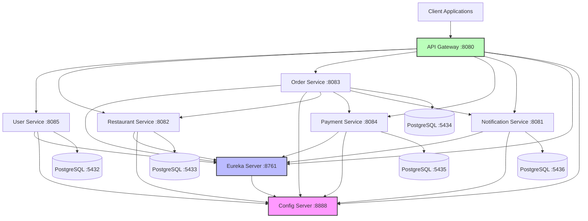

# Food Delivery Microservices - Complete Setup & Troubleshooting Guide

**Version:** 1.0  
**Date:** 2026-06-12  
**Author:** Slingshot AI Agent

---

## Table of Contents

1. [System Overview](#system-overview)
2. [Port Mapping Reference](#port-mapping-reference)
3. [Service Dependency Diagram](#service-dependency-diagram)
4. [Environment Requirements](#environment-requirements)
5. [Database Setup](#database-setup)
6. [Quick Start Guide](#quick-start-guide)
7. [Manual Startup Instructions](#manual-startup-instructions)
8. [Script Usage Guide](#script-usage-guide)
9. [API Endpoint Documentation](#api-endpoint-documentation)
10. [Troubleshooting Guide](#troubleshooting-guide)
11. [Common Error Solutions](#common-error-solutions)

---

## System Overview

### Architecture

The Food Delivery Microservices Platform is built using Spring Boot 3.2.0 and Spring Cloud 2023.0.0. It consists of:

**Infrastructure Services:**
- **Config Server** (Port 8888): Centralized configuration management
- **Eureka Server** (Port 8761): Service discovery and registration
- **API Gateway** (Ports 8080/9090): Single entry point for all client requests

**Business Services:**
- **User Service** (Port 8085): User management and authentication
- **Restaurant Service** (Port 8082): Restaurant and menu management
- **Order Service** (Port 8083): Order processing and management
- **Payment Service** (Port 8084): Payment processing
- **Notification Service** (Port 8081): Notification delivery

**Testing:**
- **E2E Tests**: Comprehensive end-to-end testing suite
- **WireMock**: External service mocking

---

## Port Mapping Reference

| Service | Port | Health Endpoint | Dashboard/UI |
|---------|------|----------------|-------------|
| Config Server | 8888 | http://localhost:8888/actuator/health | N/A |
| Eureka Server | 8761 | http://localhost:8761/actuator/health | http://localhost:8761 |
| API Gateway | 8080 | http://localhost:8080/actuator/health | N/A |
| API Gateway (Alt) | 9090 | http://localhost:9090/actuator/health | N/A |
| Notification Service | 8081 | http://localhost:8081/actuator/health | N/A |
| Restaurant Service | 8082 | http://localhost:8082/actuator/health | N/A |
| Order Service | 8083 | http://localhost:8083/actuator/health | N/A |
| Payment Service | 8084 | http://localhost:8084/actuator/health | N/A |
| User Service | 8085 | http://localhost:8085/actuator/health | N/A |

**Database Ports (PostgreSQL):**

| Service | Database Port | Database Name |
|---------|--------------|---------------|
| User Service | 5432 | userdb |
| Restaurant Service | 5433 | restaurantdb |
| Order Service | 5434 | orderdb |
| Payment Service | 5435 | paymentdb |
| Notification Service | 5436 | notificationdb |

---

## Service Dependency Diagram



**Startup Order:**
1. Config Server (must start first)
2. Eureka Server (depends on Config Server)
3. Business Services (depend on Config Server and Eureka)
4. API Gateway (depends on all services being registered)

---

## Environment Requirements

### Required Software

| Software | Minimum Version | Recommended Version | Download Link |
|----------|----------------|---------------------|---------------|
| Java JDK | 17 | 17 or 21 | https://adoptium.net/ |
| Apache Maven | 3.8.0 | 3.9.x | https://maven.apache.org/download.cgi |
| PostgreSQL | 12 | 14 or 15 | https://www.postgresql.org/download/ |
| Git | 2.30 | Latest | https://git-scm.com/downloads |

### Environment Variables

**Required:**
```powershell
# Set JAVA_HOME
$env:JAVA_HOME = "C:\Program Files\Java\jdk-17"

# Add to PATH
$env:PATH += ";$env:JAVA_HOME\bin"
```

**Optional (for production):**
```powershell
# Database credentials (override defaults)
$env:DB_USERNAME = "your_db_user"
$env:DB_PASSWORD = "your_db_password"

# JWT Secret
$env:JWT_SECRET = "your_secret_key_here"

# Spring Profiles
$env:SPRING_PROFILES_ACTIVE = "prod"
```

### Verify Installation

```powershell
# Check Java version (should be 17+)
java -version

# Check Maven version
mvn -version

# Check PostgreSQL
psql --version
```

---

## Database Setup

### Option 1: PostgreSQL Installation (Recommended for Production)

#### Step 1: Install PostgreSQL

1. Download PostgreSQL from https://www.postgresql.org/download/windows/
2. Run installer and set master password
3. Default port: 5432

#### Step 2: Create Databases

```sql
-- Connect to PostgreSQL as superuser
psql -U postgres

-- Create databases
CREATE DATABASE userdb;
CREATE DATABASE restaurantdb;
CREATE DATABASE orderdb;
CREATE DATABASE paymentdb;
CREATE DATABASE notificationdb;

-- Create user (optional)
CREATE USER fooddelivery WITH PASSWORD 'your_password';

-- Grant privileges
GRANT ALL PRIVILEGES ON DATABASE userdb TO fooddelivery;
GRANT ALL PRIVILEGES ON DATABASE restaurantdb TO fooddelivery;
GRANT ALL PRIVILEGES ON DATABASE orderdb TO fooddelivery;
GRANT ALL PRIVILEGES ON DATABASE paymentdb TO fooddelivery;
GRANT ALL PRIVILEGES ON DATABASE notificationdb TO fooddelivery;

-- Exit
\q
```

#### Step 3: Configure Multiple PostgreSQL Instances (if needed)

**For separate ports (5432-5436):**

```powershell
# Create additional PostgreSQL instances on different ports
# This requires advanced PostgreSQL configuration
# Alternatively, use single instance with multiple databases (recommended)
```

**Recommended: Use single PostgreSQL instance (port 5432) with multiple databases**

Update `config-repo/*.yml` files to use port 5432 for all services:

```yaml
spring:
  datasource:
    url: jdbc:postgresql://localhost:5432/userdb  # Change port to 5432
```

### Option 2: H2 In-Memory Database (Development Only)

Services are configured to use H2 for testing. No setup required.

### Option 3: Docker PostgreSQL

```powershell
# Run PostgreSQL in Docker
docker run --name postgres-fooddelivery `
  -e POSTGRES_PASSWORD=postgres `
  -e POSTGRES_USER=postgres `
  -p 5432:5432 `
  -d postgres:15

# Create databases
docker exec -it postgres-fooddelivery psql -U postgres -c "CREATE DATABASE userdb;"
docker exec -it postgres-fooddelivery psql -U postgres -c "CREATE DATABASE restaurantdb;"
docker exec -it postgres-fooddelivery psql -U postgres -c "CREATE DATABASE orderdb;"
docker exec -it postgres-fooddelivery psql -U postgres -c "CREATE DATABASE paymentdb;"
docker exec -it postgres-fooddelivery psql -U postgres -c "CREATE DATABASE notificationdb;"
```

### Database Schema Initialization

Schemas are automatically created using:
- `spring.jpa.hibernate.ddl-auto=update` (in config-repo/*.yml)
- `data.sql` files in each service (for sample data)

---

## Quick Start Guide

### Automated Startup (Recommended)

```powershell
# Step 1: Run diagnostics
.\diagnose-all.ps1

# Step 2: Fix any issues
.\fix-all.ps1

# Step 3: Start all services
.\start-all-services.ps1

# Step 4: Verify system health
.\verify-system.ps1

# Step 5: Run E2E tests
.\run-e2e-tests.ps1
```

### Quick Verification

1. **Check Eureka Dashboard**: http://localhost:8761
   - All 6 services should be registered

2. **Test API Gateway**: http://localhost:8080/actuator/health
   - Should return `{"status":"UP"}`

3. **Test Service via Gateway**:
   ```powershell
   curl http://localhost:8080/user-service/actuator/health
   ```

---

## Manual Startup Instructions

### Step-by-Step Manual Startup

#### 1. Start Config Server

```powershell
# Open PowerShell window 1
cd config-server
mvn clean install
mvn spring-boot:run

# Wait for: "Started ConfigServerApplication"
# Verify: http://localhost:8888/actuator/health
```

#### 2. Start Eureka Server

```powershell
# Open PowerShell window 2
cd eureka-server
mvn clean install
mvn spring-boot:run

# Wait for: "Started EurekaServerApplication"
# Verify: http://localhost:8761
```

#### 3. Start User Service

```powershell
# Open PowerShell window 3
cd user-service
mvn clean install
mvn spring-boot:run

# Wait for: "Started UserServiceApplication"
# Verify: http://localhost:8085/actuator/health
```

#### 4. Start Restaurant Service

```powershell
# Open PowerShell window 4
cd restaurant-service
mvn clean install
mvn spring-boot:run

# Wait for: "Started RestaurantServiceApplication"
# Verify: http://localhost:8082/actuator/health
```

#### 5. Start Order Service

```powershell
# Open PowerShell window 5
cd order-service
mvn clean install
mvn spring-boot:run

# Wait for: "Started OrderServiceApplication"
# Verify: http://localhost:8083/actuator/health
```

#### 6. Start Payment Service

```powershell
# Open PowerShell window 6
cd payment-service
mvn clean install
mvn spring-boot:run

# Wait for: "Started PaymentServiceApplication"
# Verify: http://localhost:8084/actuator/health
```

#### 7. Start Notification Service

```powershell
# Open PowerShell window 7
cd notification-service
mvn clean install
mvn spring-boot:run

# Wait for: "Started NotificationServiceApplication"
# Verify: http://localhost:8081/actuator/health
```

#### 8. Start API Gateway

```powershell
# Open PowerShell window 8
cd api-gateway
mvn clean install
mvn spring-boot:run

# Wait for: "Started ApiGatewayApplication"
# Verify: http://localhost:8080/actuator/health
```

### Verification Checklist

- [ ] Config Server responding on port 8888
- [ ] Eureka Server dashboard accessible at http://localhost:8761
- [ ] All 6 services registered in Eureka (USER-SERVICE, RESTAURANT-SERVICE, ORDER-SERVICE, PAYMENT-SERVICE, NOTIFICATION-SERVICE, API-GATEWAY)
- [ ] API Gateway responding on port 8080
- [ ] All health endpoints return `{"status":"UP"}`

---

## Script Usage Guide

### diagnose-all.ps1

**Purpose:** Comprehensive diagnostic check before starting services

**Usage:**
```powershell
# Basic usage
.\diagnose-all.ps1

# With verbose output
.\diagnose-all.ps1 -Verbose

# Export report to file
.\diagnose-all.ps1 -ExportReport
```

**What it checks:**
- Java and Maven installation
- Port availability (8888, 8761, 8080, 8081-8085, 9090)
- POM.xml validation
- Configuration files existence
- Database configurations
- WireMock directory structure
- Maven compilation validation

### fix-all.ps1

**Purpose:** Automatically fix common issues

**Usage:**
```powershell
# Basic usage (with confirmation)
.\fix-all.ps1

# Skip backup (not recommended)
.\fix-all.ps1 -SkipBackup

# Force execution without prompts
.\fix-all.ps1 -Force
```

**What it fixes:**
- Kills processes on conflicting ports
- Creates missing directories
- Sets up config-repo in user home
- Validates database configurations
- Optionally runs clean build

### start-all-services.ps1

**Purpose:** Start all services in correct order with health checks

**Usage:**
```powershell
# Basic usage (includes build)
.\start-all-services.ps1

# Skip build (faster, use existing JARs)
.\start-all-services.ps1 -SkipBuild

# Verbose output
.\start-all-services.ps1 -Verbose
```

**Features:**
- Sequential startup with health checks
- Eureka registration verification
- Automatic Eureka Dashboard opening
- Color-coded status updates
- Graceful failure handling

### verify-system.ps1

**Purpose:** Comprehensive system health check

**Usage:**
```powershell
# Full verification including smoke tests
.\verify-system.ps1

# Skip smoke tests
.\verify-system.ps1 -SkipSmokeTests

# Generate health report
.\verify-system.ps1 -GenerateReport
```

**What it verifies:**
- Service health endpoints
- Eureka registration
- API Gateway routing
- Database connectivity
- Smoke tests through gateway

### run-e2e-tests.ps1

**Purpose:** Execute end-to-end tests

**Usage:**
```powershell
# Run all tests
.\run-e2e-tests.ps1

# Run only integration tests
.\run-e2e-tests.ps1 -IntegrationOnly

# Run only workflow tests
.\run-e2e-tests.ps1 -WorkflowOnly

# Run only performance tests
.\run-e2e-tests.ps1 -PerformanceOnly

# Generate HTML report
.\run-e2e-tests.ps1 -GenerateReport

# Skip service verification (not recommended)
.\run-e2e-tests.ps1 -SkipServiceCheck
```

**Test Categories:**
1. **Integration Tests**: Service integration verification
2. **Workflow Tests**: Order placement workflows
3. **Performance Tests**: Load and performance testing

---

## API Endpoint Documentation

### User Service (Port 8085)

**Authentication Endpoints:**

```http
POST /api/auth/register
Content-Type: application/json

{
  "email": "user@example.com",
  "password": "password123",
  "name": "John Doe",
  "phone": "+1234567890",
  "address": {
    "street": "123 Main St",
    "city": "New York",
    "state": "NY",
    "country": "USA",
    "zipCode": "10001"
  },
  "role": "CUSTOMER"
}
```

```http
POST /api/auth/login
Content-Type: application/json

{
  "email": "user@example.com",
  "password": "password123"
}

Response:
{
  "token": "eyJhbGciOiJIUzI1NiIsInR5cCI6IkpXVCJ9...",
  "type": "Bearer",
  "id": 1,
  "email": "user@example.com",
  "name": "John Doe",
  "role": "CUSTOMER"
}
```

**User Management:**

```http
GET /api/users
Authorization: Bearer {token}

GET /api/users/{id}
GET /api/users/profile
PUT /api/users/{id}
DELETE /api/users/{id}
```

### Restaurant Service (Port 8082)

**Restaurant Endpoints:**

```http
POST /api/restaurants
Authorization: Bearer {token}
Content-Type: application/json

{
  "name": "Pizza Palace",
  "description": "Best pizza in town",
  "cuisine": "Italian",
  "address": {
    "street": "456 Food St",
    "city": "New York",
    "state": "NY",
    "country": "USA",
    "zipCode": "10002"
  },
  "phone": "+1234567891",
  "email": "contact@pizzapalace.com"
}
```

```http
GET /api/restaurants
GET /api/restaurants/{id}
GET /api/restaurants/search?cuisine=Italian
PUT /api/restaurants/{id}
DELETE /api/restaurants/{id}
```

**Menu Item Endpoints:**

```http
POST /api/restaurants/{restaurantId}/menu-items
GET /api/restaurants/{restaurantId}/menu-items
GET /api/restaurants/{restaurantId}/menu-items/{itemId}
PUT /api/restaurants/{restaurantId}/menu-items/{itemId}
DELETE /api/restaurants/{restaurantId}/menu-items/{itemId}
```

### Order Service (Port 8083)

```http
POST /api/orders
Authorization: Bearer {token}
Content-Type: application/json

{
  "restaurantId": 1,
  "items": [
    {
      "menuItemId": 1,
      "quantity": 2
    }
  ],
  "deliveryAddress": {
    "street": "123 Main St",
    "city": "New York",
    "state": "NY",
    "country": "USA",
    "zipCode": "10001"
  }
}
```

```http
GET /api/orders/{id}
GET /api/orders/user/{userId}
GET /api/orders/restaurant/{restaurantId}
PUT /api/orders/{id}/status
DELETE /api/orders/{id}
```

### Payment Service (Port 8084)

```http
POST /api/payments
GET /api/payments/{id}
GET /api/payments/order/{orderId}
PUT /api/payments/{id}/status
POST /api/payments/{id}/refund
```

### Notification Service (Port 8081)

```http
POST /api/notifications
GET /api/notifications
GET /api/notifications/{id}
POST /api/notifications/send
POST /api/notifications/email
POST /api/notifications/sms
```

### API Gateway Routes (Port 8080)

All services are accessible through the API Gateway:

```http
http://localhost:8080/user-service/**
http://localhost:8080/restaurant-service/**
http://localhost:8080/order-service/**
http://localhost:8080/payment-service/**
http://localhost:8080/notification-service/**
```

---

## Troubleshooting Guide

### Common Issues and Solutions

#### Issue 1: Port Already in Use

**Error:**
```
Web server failed to start. Port 8888 was already in use.
```

**Solution:**
```powershell
# Option 1: Use fix-all.ps1
.\fix-all.ps1

# Option 2: Manual fix
Get-NetTCPConnection -LocalPort 8888 | ForEach-Object {
    Stop-Process -Id $_.OwningProcess -Force
}
```

#### Issue 2: Config Server Not Found

**Error:**
```
Could not locate PropertySource: I/O error on GET request
```

**Solution:**
1. Ensure Config Server is running first
2. Check config-repo location:
   ```powershell
   # Verify config-repo exists
   Test-Path "$env:USERPROFILE\config-repo"
   
   # If not, run fix-all.ps1
   .\fix-all.ps1
   ```

#### Issue 3: Eureka Registration Timeout

**Error:**
```
com.netflix.discovery.shared.transport.TransportException: Cannot execute request on any known server
```

**Solution:**
1. Ensure Eureka Server is fully started (wait 30-60 seconds)
2. Check Eureka Server logs
3. Verify Eureka configuration in config-repo/application.yml

#### Issue 4: Database Connection Failed

**Error:**
```
java.sql.SQLException: Connection refused
```

**Solution:**
```powershell
# Check PostgreSQL is running
Get-Service -Name postgresql*

# Start PostgreSQL if stopped
Start-Service postgresql-x64-15

# Verify database exists
psql -U postgres -c "\l"

# Create missing databases
psql -U postgres -c "CREATE DATABASE userdb;"
```

#### Issue 5: Maven Build Failures

**Error:**
```
[ERROR] Failed to execute goal
```

**Solution:**
```powershell
# Clean Maven cache
mvn clean

# Force update dependencies
mvn clean install -U

# Skip tests if needed
mvn clean install -DskipTests
```

#### Issue 6: Service Not Registered in Eureka

**Symptom:** Service running but not visible in Eureka Dashboard

**Solution:**
1. Wait 30-60 seconds (registration delay)
2. Check service logs for Eureka client errors
3. Verify `eureka.client.service-url.defaultZone` in config
4. Restart the service

#### Issue 7: API Gateway 404 Errors

**Error:**
```
404 Not Found when accessing http://localhost:8080/user-service/api/users
```

**Solution:**
1. Verify service is registered in Eureka
2. Check API Gateway routes:
   ```powershell
   curl http://localhost:8080/actuator/gateway/routes
   ```
3. Ensure service name matches route configuration

#### Issue 8: E2E Tests Failing

**Error:**
```
java.net.ConnectException: Connection refused
```

**Solution:**
1. Ensure all services are running:
   ```powershell
   .\verify-system.ps1
   ```
2. Check WireMock directories exist:
   ```powershell
   Test-Path "e2e-tests/wiremock/mappings"
   ```
3. Increase test timeouts in test configuration

---

## Common Error Solutions

### Spring Boot Version Conflicts

**Issue:** Incompatible Spring Boot and Spring Cloud versions

**Solution:**
Ensure parent pom.xml has:
```xml
<spring-boot.version>3.2.0</spring-boot.version>
<spring-cloud.version>2023.0.0</spring-cloud.version>
```

### JWT Token Issues

**Issue:** Invalid JWT signature or expired token

**Solution:**
1. Ensure all services use same JWT secret
2. Update JWT secret in config-repo/application.yml:
   ```yaml
   jwt:
     secret: your-256-bit-secret-key-here
     expiration: 86400000  # 24 hours
   ```

### Memory Issues

**Issue:** OutOfMemoryError when running multiple services

**Solution:**
```powershell
# Increase Maven memory
$env:MAVEN_OPTS = "-Xmx2048m -XX:MaxPermSize=512m"

# Or set in each service's application.yml
spring:
  jpa:
    properties:
      hibernate:
        jdbc:
          batch_size: 20
```

### Config Refresh Not Working

**Issue:** Configuration changes not reflected in services

**Solution:**
```powershell
# Trigger config refresh
curl -X POST http://localhost:8085/actuator/refresh

# Or restart the service
```

---

## Performance Tuning

### Recommended JVM Options

```powershell
# For production
$env:JAVA_OPTS = "-Xms512m -Xmx1024m -XX:+UseG1GC"
```

### Database Connection Pool

In config-repo/application.yml:
```yaml
spring:
  datasource:
    hikari:
      maximum-pool-size: 10
      minimum-idle: 5
      connection-timeout: 30000
```

---

## Security Best Practices

1. **Never commit credentials** to config-repo
2. Use **environment variables** for sensitive data
3. Enable **HTTPS** in production
4. Rotate **JWT secrets** regularly
5. Implement **rate limiting** on API Gateway
6. Use **strong passwords** for databases

---

## Support and Resources

- **Eureka Dashboard**: http://localhost:8761
- **Config Server**: http://localhost:8888
- **API Gateway**: http://localhost:8080
- **Actuator Endpoints**: http://localhost:{port}/actuator

**Useful Commands:**
```powershell
# Check all service health
.\verify-system.ps1

# View Eureka registered services
curl http://localhost:8761/eureka/apps

# View API Gateway routes
curl http://localhost:8080/actuator/gateway/routes

# Check service info
curl http://localhost:8085/actuator/info
```

---

**Document Version:** 1.0  
**Last Updated:** 2026-06-12  
**Maintained By:** Slingshot AI Agent
